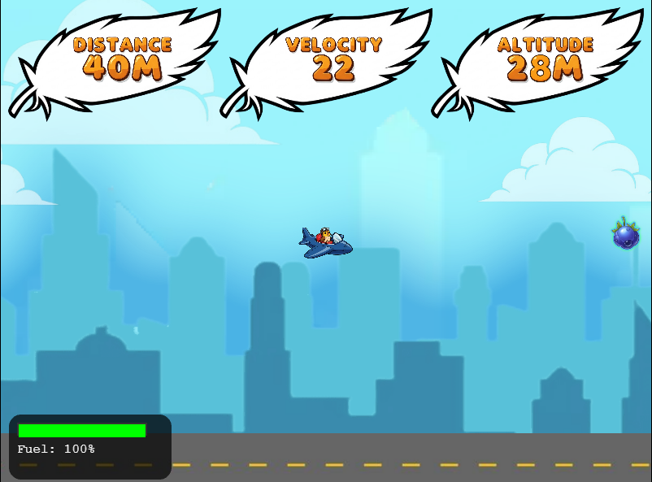
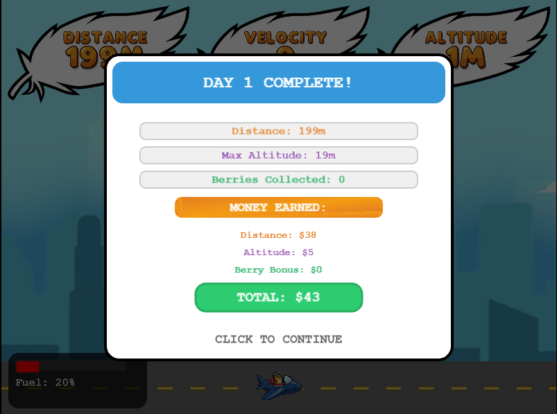
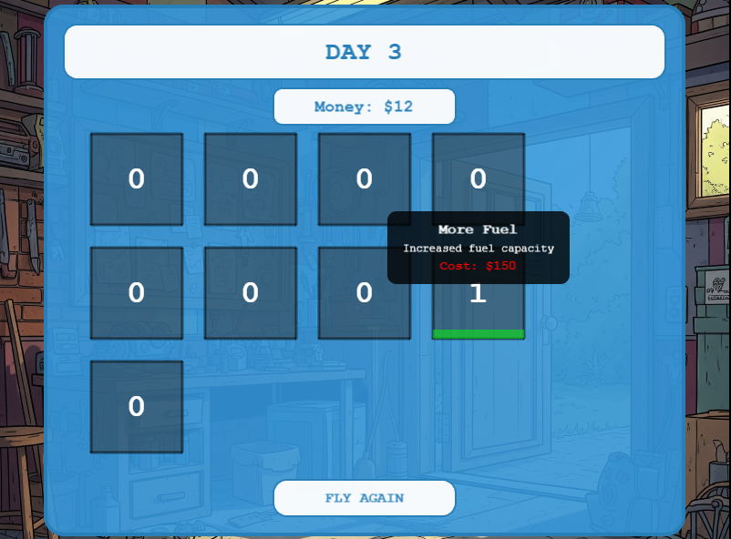

# A Sparrow's Quest

A physics-based flying adventure where you control a sparrow in a plane on an important quest!

## Game Overview

Pip is a sparrow with a super super duper important mission! Fly a plane, collect berries, and buy upgrades so that Pip can complete his journey!

## Screenshots

*The timing-based launch system*

*Soar through the skies, collecting berries*

*Recap the success of your run*

*Upgrade your sparrow between flights*

## How to Play

1. **Launch**: Click at the right moment to launch. Aim for the green zone for the best takeoff!
2. **Flight**: Hold SPACE to use your limited energy for thrust.
3. **Collect**: Gather green berries for points and boosts (avoid red ones).
4. **Goal**: Try to reach 10,000 meters to complete your quest!

*Upgrade and Repeat!*

## Save System

Your progress is automatically saved. You can:

- Start a new game
- Continue your adventure from your last save
- Reset your progress if desired

## Controls

- **Mouse Click**: Time your launch
- **SPACE**: Activate thrust (hold)

## Demo Link

[Demo](https://michaelzjqu.github.io/plane-game/)